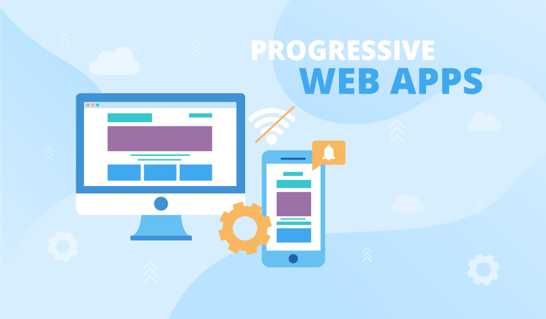
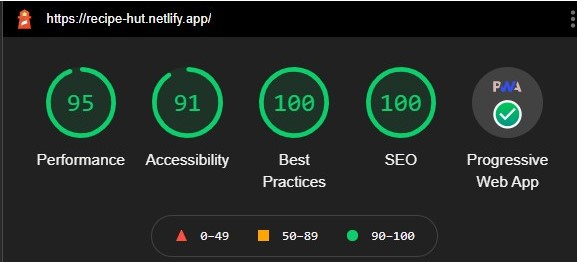

<h2 id='intro'> 🛡️ Introduction 🛡️ </h2>

 Recipe Hut is a <em><a href='#PWAs'>Progressive Web Application</a> </em>, which provides a social media platform for food enthusiasts, who like to explore new recipes and share their knowledge with others by writing blogs

 User will be provided with a random feed of recipes on their home screen, they can also search for recipes of their choice using natural language, the response of which can be obtained in two ways
 <ul>
  <li>a detailed article describing the recipe along with ingredients and steps</li>
  <li>a video from youtube provided by top chefs </li>
 </ul>
 

 
  Once the user is signed in, they will be given access to two new sections 1) profile 2) blogs 

 
 Using the profile section they can setup their profile 

 
 Users can read daily blogs posted by other users and give feedback in the form of likes and comments  💌 . Users can make use of the write section to share their recipes 🥙🥗, any other relevant information in the form of blogs 

 This application is available as a <em> <a href ='https://recipe-hut.netlify.app' target="_blank"> </em> website <a/> which is responsive to the desktop/laptop, tablet and mobile devices . This application can also be downloaded as an app on your devices by using google chromes " install app " feature 

  apk file is provided in the repo, just in case its required 
<h2> Overview </h2>
 <ul>
  <li>
    <a href ='#intro'> Introduction 🛡️ </a>
  </li>
  <li>
   <a href ='#PWAs'> What are Progressive Web Applications ? 🤔</a>
  </li>
  <li>
   <a href ='#features'> Features ✨</a>
  </li>
  <li>
     <a href ='#tech_stack'>Languages,tools and tech-features of the project 🛠️ </a>
  </li>
  <li> 
   <a href='#lighthouse_report'>Lighthouse report 🏘️</a>
 </ul>
 

  <h3> 📱🌐 Progressive Web Application 🌐📱 </h3>
  
  
 In simple words , Progressive Web Apps (PWAs) are web applications that are regular web pages or websites, but can appear to the user like 
      traditional applications or native mobile applications. The application type attempts to combine features offered by most modern browsers with the benefits of a 
      mobile experience. It works offline when you don't have an internet connection, leveraging data cached during your last interactions with the app'
  

<!--   features-->

 <h3> ✨ Features ✨</h3>
 <ul>
   <li>Signin using google </li>
   <li>Sign in using email and password</li>
   <li>Talk to the bot and ask nutritional information about various food items and ingredients, get random food trivia</li>
   <li> Setup your profile upload your profile picture and be identified in the site,view others  profile
   </li>
   <li>Write blogs, share your views on others blogs by commenting on them</li>
   <li>Add, remove recipes to your favourites to view them later</li>
   <li>Track your search History</li>
   <li>Get random feed of recipes </li>
   <li>Search for particular recipes using natural language</li>
   <li>Glassmorphic UI</li>
 </ul>
 
 Dual mode application 

 <ul> 
  <li> User mode </li>
  <li> <b>Admin mode</b> : ability to modify and delete blogs </li>
 </ul>

 

 <h3>🛠️ Languages,tools and tech-features of the project 🛠️ </h3>
  <ul>
   <li> Reactjs </li>
   <li> Firebase </li>
   <li> Sass  </li>
   <li> React-hooks </li>
   <li> Axios </li>
   <li> React-dom </li>
   <li> REST API </li>
   <li>speech-recognition </li>
    <li>react-router </li>
  </ul>
   <ul>
    Some additional features
   <li> Glassmorphic Ui </li>
   <li>css-animation-effects </li>
    <li> Svg Components </li>
   <li>responsive-web-design </li>
   <li> Pagination </li>
   <li> Toastification </li>
  </ul>
 

<!-- report  -->
 

 <h3> 🏘️ Lighthouse report 🏘️</h3>
 
This application has recieved the following report from light house

 
 

 {lost few points in accessibility for not placing lables for colorpicker and navbar tags, which was intentional }

 

 
